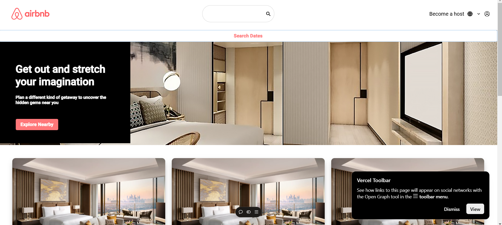

# Airbnb React Home Page Clone

 <!-- Replace with a project image -->

This is a **React** clone of the **Airbnb Home Page**. The goal of this project was to recreate the layout and functionality of Airbnb's landing page using React and other modern web development tools. This clone allows users to browse featured listings, explore various destinations, and interact with an elegant, user-friendly interface.

## 🚀 Features

- **Responsive Design**: The layout is fully responsive and optimized for mobile, tablet, and desktop views.
- **React Components**: The page is built with reusable React components for easy maintainability and scalability.
- **Dynamic Data Rendering**: Uses mock data to dynamically render listings, featured properties, and other UI elements.
- **Search Functionality**: Implements a simple search bar to filter locations or listings.
- **Styled with CSS**: Clean and modern design inspired by the official Airbnb homepage.

## 🛠️ Technologies Used

- **React**: JavaScript library for building user interfaces.
- **React Router**: For seamless navigation between pages.
- **CSS (Styled Components / SCSS)**: For styling the page with modern CSS techniques.
- **Axios**: For API calls (if needed for dynamic data fetching).
- **Material UI** (Optional): For quick component building and styling.

## 🌐 Live Demo

You can view the live demo of the Airbnb Home Page Clone here:

[Live Demo](https://your-link.com)

## 🎯 Getting Started

To get a copy of the project up and running on your local machine, follow these steps:

1. **Clone the repository:**

   ```bash
   git clone https://github.com/yourusername/airbnb-homepage-clone.git
   cd airbnb-homepage-clone
2.  Install dependencies:

    If you don’t have npm or yarn installed, you can install them from here.

    Run:

    ```bash
    npm install
    yarn install

3. Run the development server:

    ```bash
    npm start
    yarn start

Visit http://localhost:3000 in your browser.

## 📸 Screenshots
Here are some screenshots of the clone in action:

# Home Page


# Search Bar


## 🤝 Contributing
Contributions are welcome! If you'd like to improve the project, feel free to:

Fork the repository.
Create a new branch (git checkout -b feature/your-feature).
Commit your changes (git commit -am 'Add your feature').
Push to the branch (git push origin feature/your-feature).